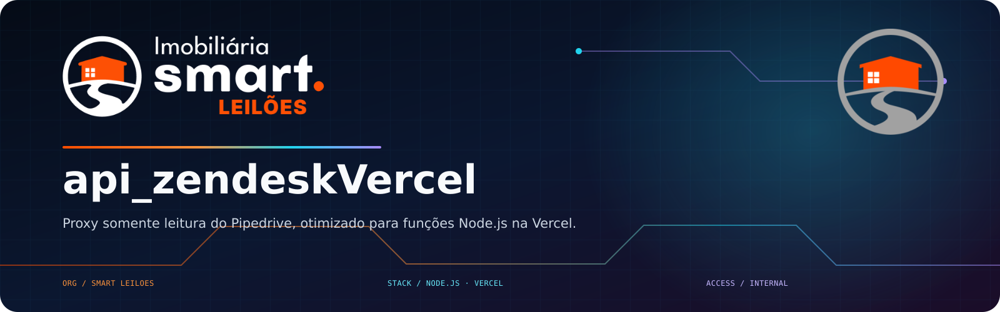

<!-- smart-leiloes-brand:start -->

  

  
  
  

Smart Leilões Imobiliária · Tecnologia, automação e operação conectadas.

<!-- smart-leiloes-brand:end -->

# api_zendeskVercel

Proxy somente leitura do Pipedrive, otimizado para funções Node.js na Vercel.
